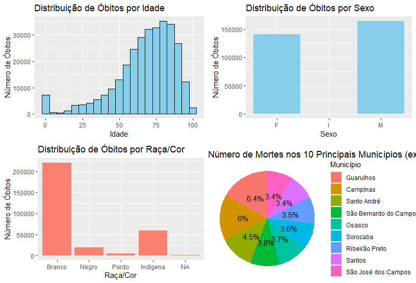
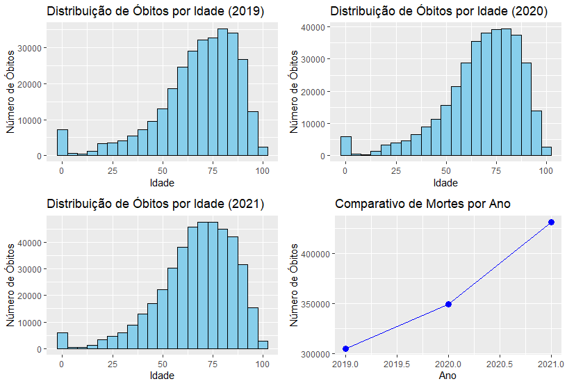

# Relatório de Análise de Óbitos no Estado de São Paulo

## Introdução

Este relatório apresenta uma análise dos dados de óbitos no Estado de São Paulo nos anos de 2019, 2020 e 2021. O objetivo principal é explorar a distribuição desses óbitos, identificar padrões e tendências ao longo dos anos e fornecer insights que possam ser úteis para políticas de saúde pública e intervenções preventivas.

## Bases de Dados

Foram utilizadas três bases de dados fornecidas pelo SEADE (Sistema Estadual de Análise de Dados): microdados de óbitos dos anos de 2019, 2020 e 2021. Cada base contém informações sobre os óbitos registrados no estado, incluindo dados demográficos, como idade, sexo, raça/cor, e localização geográfica.

## Análises Realizadas

### Distribuição de Óbitos por Idade

```R
# Código fonte para o histograma da distribuição de óbitos por idade
histograma_idade <- ggplot(data = microdadosobitos2019, aes(x = idadeanos)) +
  geom_histogram(binwidth = 5, fill = "skyblue", color = "black") +
  labs(title = "Distribuição de Óbitos por Idade",
       x = "Idade",
       y = "Número de Óbitos"
```

### Distribuição de Óbitos por Sexo
```R
# Código fonte para o gráfico de barras da distribuição de óbitos por sexo
grafico_sexo <- ggplot(data = microdadosobitos2019, aes(x = sexo, fill = sexo)) +
  geom_bar() +
  scale_fill_manual(values = c("M" = "blue", "F" = "pink")) +
  labs(title = "Distribuição de Óbitos por Sexo",
       x = "Sexo",
       y = "Número de Óbitos")
```

### Distribuição de Óbitos por Raça/Cor
```R
# Código fonte para o gráfico de barras da distribuição de óbitos por raça/cor
grafico_raca_cor <- ggplot(data = microdadosobitos2019, aes(x = racacor)) +
  geom_bar(fill = "salmon") +
  labs(title = "Distribuição de Óbitos por Raça/Cor",
       x = "Raça/Cor",
       y = "Número de Óbitos")
```

### Número de Mortes nos 10 Principais Distritos
```R
# Código fonte para o gráfico de pizza do número de mortes nos 10 principais municípios
gg_pizza <- ggplot(mortes_por_distrito, aes(x = "", y = numero_de_mortes, fill = nome_distrito)) +
  geom_bar(stat = "identity", width = 1) +
  geom_text(aes(label = paste0(round(percentual, 1), "%")), position = position_stack(vjust = 0.5)) +
  coord_polar("y", start = 0) +
  labs(title = "Número de Mortes nos 10 Principais Distritos",
       fill = "Distrito") +
  theme_void() +
  theme(legend.position = "right")
```
### Resultados Obtidos


Os resultados das análises forneceram insights valiosos sobre a distribuição de óbitos no Estado de São Paulo ao longo dos anos. Destacamos que a maioria dos óbitos ocorreu em indivíduos de idade avançada, com uma distribuição semelhante entre os sexos. Quanto à raça/cor, observou-se uma predominância de óbitos entre indivíduos brancos, seguidos por pardos e negros. Além disso, foi identificado um padrão geográfico nas mortes, com os 10 principais municípios concentrando a maioria dos óbitos.

Adicionalmente criei mais um gráfico de linhas comparando o número de mortes nos anos de 2019, 2020 e 2021 mostrou variações ao longo do tempo. Em particular, foi observado um aumento significativo no número de mortes em 2020, seguido novo aumento  em 2021. Essas tendências podem ser influenciadas por uma série de fatores, incluindo eventos pandêmicos, políticas de saúde e condições socioeconômicas.




### Conclusão
As análises realizadas forneceram insights valiosos sobre a distribuição de óbitos no Estado de São Paulo nos anos de 2019, 2020 e 2021. Através da exploração dos dados demográficos, foi possível identificar padrões e tendências que podem ser fundamentais para direcionar políticas de saúde pública e intervenções preventivas.

Além disso, destaco o potencial futuro de utilização da biblioteca geobr para análises em mapas vetoriais. Com essa ferramenta, seria possível visualizar a distribuição geográfica dos óbitos e identificar padrões espaciais que podem não ser evidentes em análises tabulares. No entanto, para implementar essa abordagem, seria necessário encontrar uma base de dados que relacione o nome do município com as coordenadas de latitude e longitude correspondentes. Esse é um objetivo que pode ser explorado em trabalhos futuros, a fim de enriquecer ainda mais a compreensão da distribuição geográfica dos óbitos e suas possíveis causas.
